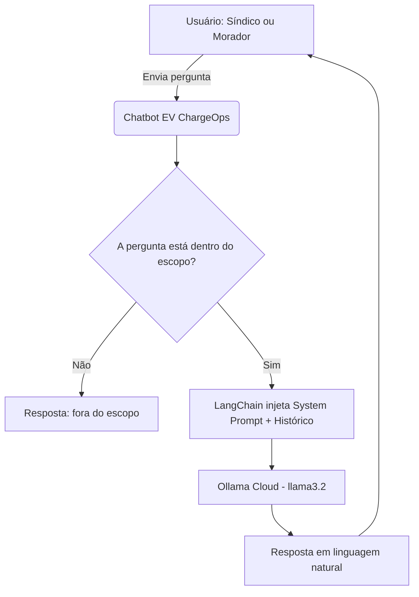

# EV ChargeOps — Chatbot Inteligente

> Assistente conversacional com IA para gestão de eletropostos em condomínios
> no contexto do EV Challenge 2026.

---

## Equipe

| Nome | RM |
|------|----|
| Luan de Araujo Carneiro | RM 573691 |
| Pedro Sampaio Mochnacs Arruda | RM 573522 |
| Raul Sampaio Mochnacs Arruda | RM 573523 |
| Lucas Garcia de Britto | RM 571768 |
| Kevin Rodrigues de Melo | RM 571777 |

---

## Problema Abordado

A expansão dos veículos elétricos em condomínios residenciais expõe dois problemas
centrais que ainda carecem de solução integrada:

- **Ausência de orquestração de potência:** sem controle inteligente, o uso
  simultâneo de múltiplos carregadores sobrecarrega o sistema elétrico do prédio.
- **Falta de transparência no consumo:** sem medição individual, o rateio de
  custos é injusto e gera conflitos entre moradores.

Além disso, síndicos e moradores não dispõem de uma interface simples para
consultar dados de consumo, sessões de recarga ou alertas do sistema —
dependendo de dashboards técnicos que exigem conhecimento especializado.

---

## Diferencial Competitivo

Diferente de dashboards tradicionais, o EV ChargeOps elimina a necessidade de
navegação técnica, permitindo acesso direto aos dados via linguagem natural.
Síndicos e moradores obtêm respostas precisas sem precisar interpretar gráficos
ou relatórios complexos.

---

## Proposta do Chatbot

O chatbot do EV ChargeOps é um assistente conversacional com IA projetado como
ferramenta operacional real, não como demonstração genérica. Ele atua como
interface de linguagem natural entre os usuários e o sistema de gestão de
eletropostos.

### Persona Atendida

O chatbot é direcionado primariamente ao **síndico** e secundariamente aos
**moradores**. O contexto condominial foi escolhido por ser o cenário mais
crítico do EV Challenge 2026: múltiplos usuários, infraestrutura compartilhada
e necessidade de rateio justo de custos.

| Persona | Decisão | Justificativa |
|---------|---------|---------------|
| Síndico | Primária | Necessita de visão geral do sistema, alertas e relatórios de consumo |
| Morador | Secundária | Consultas individuais de consumo e dúvidas sobre cobrança |
| Operador Comercial | Descartada | EV ChargeOps atende condomínios residenciais, não postos comerciais |

### O que o Chatbot Responde

- Consultas de consumo por unidade e por período
- Dúvidas sobre sessões de recarga registradas
- Alertas e previsões de pico de demanda
- Dúvidas sobre cobrança e rateio de energia
- Orientações sobre o uso do sistema

---

## Tecnologias Selecionadas e Justificativa Técnica

| Tecnologia | Função | Justificativa |
|------------|--------|---------------|
| **Ollama Cloud** (llama3.2) | Modelo de linguagem principal | Solução gratuita e open source, sem necessidade de API Key ou custos por token. Capacidade de compreensão contextual adequada para o domínio técnico do projeto |
| **LangChain** | Orquestração do fluxo do chatbot | Facilita a injeção de contexto e gerenciamento de histórico de conversa |
| **Python** | Linguagem principal do projeto | Ecossistema rico para IA, compatibilidade com Ollama e LangChain, curva de aprendizado adequada ao time |

---

## Fluxograma de Funcionamento



---

## Modelo de Teste — Perguntas e Respostas Esperadas

| # | Pergunta | Dentro/Fora do Escopo | Resposta Esperada |
|---|----------|-----------------------|-------------------|
| 1 | Qual apartamento mais consumiu energia este mês? | Dentro | O chatbot identifica a unidade com maior consumo registrado no período e informa o valor em kWh e o custo correspondente. |
| 2 | Quantas sessões de recarga foram realizadas hoje? | Dentro | O chatbot retorna o número de sessões do dia, com horários de início e fim de cada uma. |
| 3 | Como é feito o rateio da conta de luz entre os moradores? | Dentro | O chatbot explica o modelo de medição individual por sessão, com base na Resolução ANEEL 1.000/2021. |
| 4 | Qual o prazo de retorno do investimento na instalação dos eletropostos? | Dentro | O chatbot explica os fatores que influenciam o retorno, como número de unidades, consumo médio e tarifa de energia. |
| 5 | Quantos eletropostos eu precisaria instalar para um condomínio com 40 apartamentos? | Dentro | O chatbot orienta sobre critérios de dimensionamento com base no número de unidades e demanda estimada. |
| 6 | Qual o melhor carro elétrico para comprar? | Fora | O chatbot informa que só responde sobre gestão de eletropostos e consumo no condomínio. |
| 7 | Tem algum restaurante perto do condomínio? | Fora | O chatbot redireciona educadamente para o escopo do sistema EV ChargeOps. |

---

## System Prompt Base

```
[1] IDENTIDADE:
Você é o assistente inteligente do EV ChargeOps, um sistema de gestão de
eletropostos para condomínios residenciais no contexto do EV Challenge 2026.

[2] CONTEXTO:
O EV ChargeOps é um sistema voltado para condomínios residenciais que precisam
gerenciar o uso compartilhado de eletropostos entre os moradores.

O sistema permite consultar informações sobre sessões de recarga, consumo por
unidade, rateio de custos e orientações sobre o uso dos eletropostos — tudo
via linguagem natural, sem necessidade de acesso a dashboards técnicos.

[3] REGRAS:
- Responda APENAS sobre o sistema EV ChargeOps e eletropostos do condomínio.
- Se a pergunta for fora do escopo, diga: "Só consigo ajudar com questões
  relacionadas ao EV ChargeOps e aos eletropostos do condomínio."
- Nunca invente dados, especificações técnicas ou valores de consumo.
- Não opine sobre outros fabricantes ou sistemas de carregamento.

[4] TOM DE VOZ:
Seja claro, objetivo e use linguagem acessível, sem jargões técnicos
desnecessários. Responda sempre em português brasileiro.

[5] CONTEXTO DO SISTEMA:
- O sistema atende condomínios residenciais com múltiplos usuários de veículos elétricos
- O rateio de custos é individual, por sessão, seguindo a Resolução ANEEL 1.000/2021
- O chatbot orienta síndicos e moradores sobre consumo, cobrança e uso do sistema
- Picos de demanda são previstos para evitar sobrecarga na rede elétrica do prédio
```

---

## Exemplo de Interação

**Pergunta:** Qual apartamento mais consumiu energia este mês?

**Resposta:** O apartamento 302 foi o que mais consumiu energia no período,
com 245 kWh registrados, resultando em um custo estimado de R$ 198,00.

---

**Pergunta:** Como é feito o rateio entre os moradores?

**Resposta:** O rateio é feito de forma individual por sessão de recarga.
Cada morador paga exatamente pelo que consumiu, seguindo as regras da
Resolução ANEEL 1.000/2021.

---

**Pergunta:** Tem algum restaurante perto do condomínio?

**Resposta:** Só consigo ajudar com questões relacionadas ao EV ChargeOps
e aos eletropostos do condomínio. Posso te ajudar com algo nessa área?

---

> Projeto desenvolvido para o EV Challenge 2026 — FIAP
> Matéria: Prompt and Artificial Intelligence
