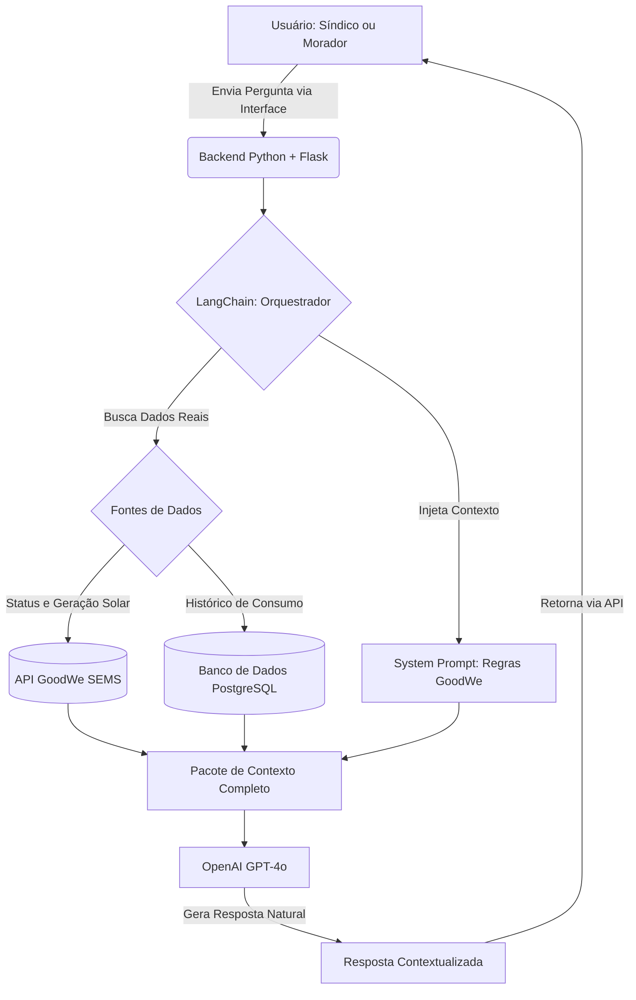

 EV ChargeOps — Chatbot Inteligente

> Assistente conversacional com IA para gestão de eletropostos em condomínios,
> integrado ao ecossistema GoodWe SEMS no contexto do EV Challenge 2026.

---

## Equipe

| Nome | RM |
|------|----|
| Luan de Araujo Carneiro | RM 573691 |
| Pedro Sampaio Mochnacs Arruda | RM 573522 |
| Raul Sampaio Mochnacs Arruda | RM 573523 |
| Lucas Garcia de Britto | RM 571768 |
| Kevin Rodrigues de Melo | RM 571777 |

---

## Problema Abordado

A expansão dos veículos elétricos em condomínios residenciais expõe dois problemas
centrais que ainda carecem de solução integrada:

- **Ausência de orquestração de potência:** sem controle inteligente, o uso
simultâneo de múltiplos carregadores sobrecarrega o sistema elétrico do prédio.
- **Falta de transparência no consumo:** sem medição individual, o rateio de
custos é injusto e gera conflitos entre moradores.

Além disso, síndicos e moradores não dispõem de uma interface simples para
consultar dados de consumo, sessões de recarga ou alertas do sistema —
dependendo de dashboards técnicos que exigem conhecimento especializado.

---

## Diferencial Competitivo

Diferente de dashboards tradicionais, o EV ChargeOps elimina a necessidade de
navegação técnica, permitindo acesso direto aos dados via linguagem natural.
Síndicos e moradores obtêm respostas precisas sem precisar interpretar gráficos
ou relatórios complexos.

---

## Proposta do Chatbot

O chatbot do EV ChargeOps é um assistente conversacional com IA projetado como
ferramenta operacional real, não como demonstração genérica. Ele atua como
interface de linguagem natural entre os usuários e os dados do sistema de
gestão de eletropostos.

### Persona Atendida

O chatbot é direcionado primariamente ao **síndico** e secundariamente aos
**moradores**, respondendo perguntas sobre consumo, sessões de recarga,
alertas de demanda e cobrança — sem necessidade de acesso ao dashboard técnico.

A persona do **Operador Comercial** foi descartada pois o EV ChargeOps atende
condomínios residenciais, não postos comerciais. A persona do **Técnico** está
prevista para versões futuras do sistema, com respostas mais especializadas
sobre protocolos, configurações e diagnósticos.

### O que o Chatbot Responde

- Consultas de consumo por unidade e por período
- Status dos carregadores em tempo real
- Alertas e previsões de pico de demanda
- Informações sobre sessões de recarga registradas
- Dúvidas sobre cobrança e rateio de energia
- Orientações sobre o uso do sistema

---

## Tecnologias Selecionadas e Justificativa Técnica

| Tecnologia | Função | Justificativa |
|------------|--------|---------------|
| **OpenAI API (GPT-4o)** | Modelo de linguagem principal | Alta capacidade de compreensão contextual, ideal para respostas precisas em domínio técnico específico |
| **LangChain** | Orquestração do fluxo do chatbot | Facilita a injeção de contexto, gerenciamento de histórico de conversa e integração com fontes de dados externas |
| **Python + Flask** | Backend da API do chatbot | Consistência com o restante da stack do projeto, leveza e facilidade de integração |
| **API GoodWe SEMS** | Fonte de dados em tempo real | Dados simulados (mock) estruturados conforme o padrão da API GoodWe SEMS, permitindo validação da integração |
| **PostgreSQL** | Histórico de sessões e consumo | Permite ao chatbot consultar dados históricos para responder perguntas de períodos específicos |

---

## Fluxo de Funcionamento

### Resumo do Fluxo

1. Usuário envia uma pergunta via interface (Dashboard ou app)
2. A mensagem é recebida pelo backend Flask
3. LangChain injeta o system prompt com o contexto do EV ChargeOps
4. Se necessário, o sistema consulta a API GoodWe SEMS ou o banco de dados
5. O modelo GPT-4o processa a pergunta com o contexto completo
6. A resposta é gerada em linguagem natural e retornada ao usuário

---

## Exemplo de Interação

**Pergunta:** Qual apartamento mais consumiu energia este mês?

**Resposta:** O apartamento 302 foi o que mais consumiu energia no período,
com 245 kWh registrados, resultando em um custo estimado de R$ 198,00.

---

**Pergunta:** O sistema está usando energia solar agora?

**Resposta:** Sim. Neste momento o sistema registra geração solar de 4,2 kW,
com excedente de 1,8 kW sendo direcionado automaticamente para os carregadores ativos.

---

**Pergunta:** Tem algum restaurante perto do condomínio?

**Resposta:** Só consigo ajudar com questões relacionadas ao EV ChargeOps
e aos eletropostos do condomínio. Posso te ajudar com algo nessa área?

---

## Modelo de Teste — Perguntas e Respostas Esperadas

| # | Pergunta | Dentro/Fora do Escopo | Resposta Esperada |
|---|----------|-----------------------|-------------------|
| 1 | Qual apartamento mais consumiu energia este mês? | Dentro | O sistema identifica a unidade com maior consumo registrado no período e informa o valor em kWh e o custo correspondente. |
| 2 | Quantas sessões de recarga foram realizadas hoje? | Dentro | O chatbot consulta o banco de dados e retorna o número de sessões do dia, com horários de início e fim de cada uma. |
| 3 | Tem algum carregador com problema agora? | Dentro | O chatbot verifica o status em tempo real via API GoodWe SEMS e informa se há carregadores offline ou com falha. |
| 4 | O sistema está usando energia solar agora? | Dentro | O chatbot consulta a geração solar atual e informa se há excedente sendo direcionado para os carregadores. |
| 5 | Como é feito o rateio da conta de luz entre os moradores? | Dentro | O chatbot explica o modelo de medição individual por sessão, com base nas regras configuradas e na Resolução ANEEL 1.000/2021. |
| 6 | Qual o melhor carro elétrico para comprar? | Fora | O chatbot informa que só responde sobre gestão de eletropostos e consumo no condomínio, e se oferece para ajudar com isso. |
| 7 | Tem algum restaurante perto do condomínio? | Fora | O chatbot redireciona educadamente para o escopo do sistema EV ChargeOps. |

---

## System Prompt Base
[1] IDENTIDADE:
Você é o assistente inteligente do EV ChargeOps, um sistema de gestão de
eletropostos para condomínios residenciais integrado à plataforma GoodWe SEMS.
[2] CONTEXTO:
O EV ChargeOps monitora e controla eletropostos em condomínios residenciais,
priorizando o uso de energia solar excedente para recarga de veículos elétricos.

O sistema realiza medição individual por sessão, aplica regras de rateio e
conta com um modelo de previsão de demanda baseado em Machine Learning.

A arquitetura utiliza uma camada de abstração de dados, responsável por fornecer
informações ao chatbot de forma desacoplada da fonte original.

Atualmente, os dados são simulados (mock), seguindo o padrão esperado da API
GoodWe SEMS, permitindo validar o comportamento do sistema e a geração de
respostas baseadas em dados dinâmicos.
Essa camada foi projetada para futura integração com a API real da GoodWe SEMS,
sem necessidade de alterações na lógica do chatbot.
[3] REGRAS:

Responda APENAS sobre o sistema EV ChargeOps e eletropostos do condomínio.
Se a pergunta for fora do escopo, diga: "Só consigo ajudar com questões
relacionadas ao EV ChargeOps e aos eletropostos do condomínio."
Nunca invente dados, especificações técnicas ou valores de consumo.
Não opine sobre outros fabricantes ou sistemas de carregamento.
Se não tiver acesso a uma informação em tempo real, oriente o usuário
a consultar diretamente o dashboard.

[4] TOM DE VOZ:
Seja claro, objetivo e use linguagem acessível, sem jargões técnicos
desnecessários. Responda sempre em português brasileiro.
[5] CONTEXTO DO SISTEMA:

O condomínio utiliza painéis solares integrados via API GoodWe SEMS
O sistema prioriza o uso de energia solar excedente para recarga dos veículos
O rateio de custos é individual, por sessão, seguindo a Resolução ANEEL 1.000/2021
Os carregadores são monitorados a cada 30 segundos
Picos de demanda são previstos por um modelo de previsão de demanda
baseado em Machine Learning

---

## Conclusão

O chatbot do EV ChargeOps transforma dados técnicos complexos em respostas
acessíveis para síndicos e moradores, democratizando o acesso às informações
do sistema de gestão de energia. Com isso, o projeto avança na direção de uma
mobilidade elétrica mais transparente, justa e sustentável nos condomínios
brasileiros.

---

> Projeto desenvolvido para o EV Challenge 2026 — FIAP
> Projeto desenvolvido para a matéria de Prompt and Artificial Intelligence
