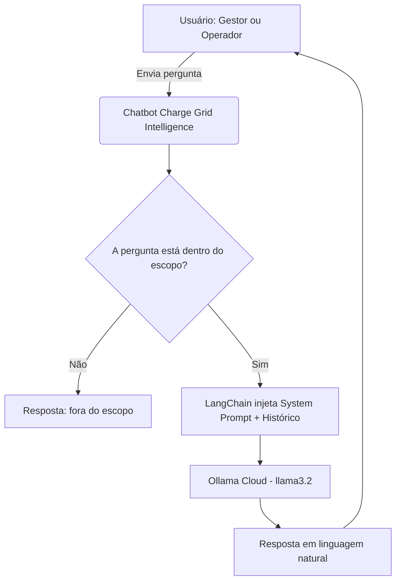

# Charge Grid Intelligence — Chatbot Inteligente

> Assistente conversacional com IA para gestão de eletropostos em postos comerciais e frotas  
> no contexto do EV Challenge 2026 — GoodWe / FIAP

---

## Equipe

| Nome | RM |
|------|----|
| Luan de Araujo Carneiro | RM 573691 |
| Pedro Sampaio Mochnacs Arruda | RM 573522 |
| Raul Sampaio Mochnacs Arruda | RM 573523 |
| Lucas Garcia de Britto | RM 571768 |
| Kevin Rodrigues de Melo | RM 571777 |

---

## Problema Abordado

A expansão dos veículos elétricos em operações comerciais expõe dois problemas
centrais que ainda carecem de solução integrada:

- **Ausência de orquestração de potência:** sem controle inteligente, o uso
  simultâneo de múltiplos carregadores sobrecarrega a infraestrutura elétrica do posto,
  gerando custos elevados de demanda e risco de interrupção do serviço.
- **Falta de visibilidade operacional:** sem monitoramento em tempo real, operadores
  não conseguem otimizar a disponibilidade dos carregadores, prever picos de demanda
  ou identificar falhas com agilidade.

Além disso, gestores e operadores não dispõem de uma interface simples para
consultar dados de consumo, sessões de recarga ou alertas do sistema —
dependendo de dashboards técnicos que exigem conhecimento especializado.

---

## Diferencial Competitivo

Diferente de dashboards tradicionais, o Charge Grid Intelligence elimina a necessidade de
navegação técnica, permitindo acesso direto aos dados via linguagem natural.
Gestores e operadores obtêm respostas precisas sem precisar interpretar gráficos
ou relatórios complexos, acelerando a tomada de decisão em ambiente comercial.

---

## Proposta do Chatbot

O chatbot do Charge Grid Intelligence é um assistente conversacional com IA projetado como
ferramenta operacional real, não como demonstração genérica. Ele atua como
interface de linguagem natural entre os usuários e o sistema de gestão de
eletropostos comerciais.

### Persona Atendida

O chatbot é direcionado primariamente ao **gestor do posto** e secundariamente aos
**operadores e atendentes**. O contexto comercial foi escolhido por ser o cenário mais
crítico do EV Challenge 2026: alta rotatividade de usuários, infraestrutura intensiva
e necessidade de maximização da receita e disponibilidade dos carregadores.

| Persona | Decisão | Justificativa |
|---------|---------|---------------|
| Gestor do Posto | Primária | Necessita de visão geral do sistema, relatórios de receita, alertas e controle de disponibilidade |
| Operador / Atendente | Secundária | Consultas rápidas sobre status dos carregadores, sessões ativas e falhas |
| Morador de Condomínio | Descartada | Charge Grid Intelligence atende operações comerciais, não condomínios residenciais |

### O que o Chatbot Responde

- Consultas de consumo por carregador e por período
- Status em tempo real das sessões de recarga ativas
- Alertas e previsões de pico de demanda
- Dúvidas sobre faturamento e receita por ponto de carga
- Orientações sobre o uso e manutenção do sistema

---

## Tecnologias Selecionadas e Justificativa Técnica

| Tecnologia | Função | Justificativa |
|------------|--------|---------------|
| **Ollama Cloud** (llama3.2) | Modelo de linguagem principal | Solução gratuita e open source, sem necessidade de API Key ou custos por token. Capacidade de compreensão contextual adequada para o domínio técnico do projeto |
| **LangChain** | Orquestração do fluxo do chatbot | Facilita a injeção de contexto e gerenciamento de histórico de conversa |
| **Python** | Linguagem principal do projeto | Ecossistema rico para IA, compatibilidade com Ollama e LangChain, curva de aprendizado adequada ao time |

---

## Fluxograma de Funcionamento



> O fluxograma representa o ciclo completo de uma interação: entrada do usuário,
> verificação de escopo, injeção de contexto via LangChain, processamento pelo LLM
> e retorno da resposta contextualizada.

---

## Modelo de Teste — Perguntas e Respostas Esperadas

| # | Pergunta | Dentro/Fora do Escopo | Resposta Esperada |
|---|----------|-----------------------|-------------------|
| 1 | Qual carregador gerou mais receita este mês? | Dentro | O chatbot identifica o ponto de carga com maior faturamento no período e informa o valor em R$ e o volume em kWh fornecido. |
| 2 | Quantas sessões de recarga foram realizadas hoje? | Dentro | O chatbot retorna o número de sessões do dia, com horários de início e fim de cada uma. |
| 3 | Como é feita a cobrança dos usuários no posto? | Dentro | O chatbot explica o modelo de cobrança por kWh consumido ou por tempo de sessão, conforme configurado no sistema. |
| 4 | Qual o prazo de retorno do investimento na instalação dos eletropostos? | Dentro | O chatbot explica os fatores que influenciam o retorno, como volume de sessões, ticket médio e tarifa de energia. |
| 5 | Quantos carregadores eu precisaria instalar para um posto com alto fluxo de veículos? | Dentro | O chatbot orienta sobre critérios de dimensionamento com base no fluxo estimado de veículos e tempo médio de recarga. |
| 6 | Qual o melhor carro elétrico para comprar? | Fora | O chatbot informa que só responde sobre gestão de eletropostos e operação comercial. |
| 7 | Tem algum restaurante perto do posto? | Fora | O chatbot redireciona educadamente para o escopo do sistema Charge Grid Intelligence. |

---

## System Prompt Base

```
[1] IDENTIDADE:
Você é o assistente inteligente do Charge Grid Intelligence, um sistema de gestão de
eletropostos para operações comerciais no contexto do EV Challenge 2026.

[2] CONTEXTO:
O Charge Grid Intelligence é um sistema voltado para postos comerciais e operadores
de frotas que precisam gerenciar eletropostos de alto fluxo de forma eficiente.

O sistema permite consultar informações sobre sessões de recarga, receita por ponto
de carga, disponibilidade dos carregadores e orientações sobre operação e manutenção —
tudo via linguagem natural, sem necessidade de acesso a dashboards técnicos.

[3] REGRAS:
- Responda APENAS sobre o sistema Charge Grid Intelligence e eletropostos comerciais.
- Se a pergunta for fora do escopo, diga: "Só consigo ajudar com questões
  relacionadas ao Charge Grid Intelligence e à operação dos eletropostos."
- Nunca invente dados, especificações técnicas ou valores de consumo.
- Não opine sobre outros fabricantes ou sistemas de carregamento.

[4] TOM DE VOZ:
Seja claro, objetivo e use linguagem acessível, sem jargões técnicos
desnecessários. Responda sempre em português brasileiro.

[5] CONTEXTO DO SISTEMA:
- O sistema atende postos comerciais e frotas com múltiplos pontos de carga e alta rotatividade
- A cobrança é feita por kWh consumido ou por tempo de sessão, conforme configuração do operador
- O chatbot orienta gestores e operadores sobre consumo, faturamento e disponibilidade do sistema
- Picos de demanda são previstos para evitar sobrecarga na infraestrutura elétrica do posto
```

---

## Exemplos de Interação

**Pergunta:** Qual carregador gerou mais receita este mês?

**Resposta:** O carregador 03 foi o que mais gerou receita no período,
com 312 kWh fornecidos, resultando em um faturamento de R$ 280,80.

---

**Pergunta:** Como é feita a cobrança dos usuários no posto?

**Resposta:** A cobrança é feita por kWh consumido em cada sessão de recarga.
O valor é calculado automaticamente ao final da sessão com base na tarifa
configurada pelo operador do posto.

---

**Pergunta:** Tem algum restaurante perto do posto?

**Resposta:** Só consigo ajudar com questões relacionadas ao Charge Grid Intelligence
e à operação dos eletropostos. Posso te ajudar com algo nessa área?

---

> Projeto desenvolvido para o EV Challenge 2026 — FIAP  
> Matéria: Prompt and Artificial Intelligence
```


